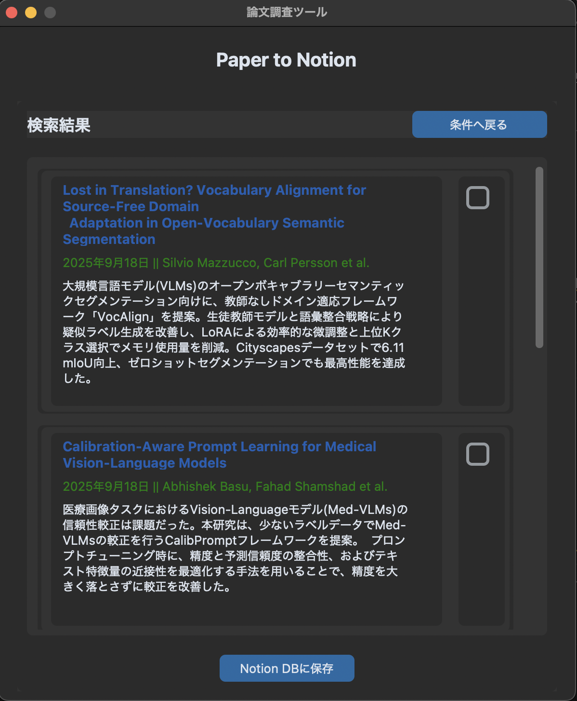

# paper-to-notion

| 検索画面 | 結果表示画面 |
|:--------:|:------------:|
|  |  |

## 概要
arXivからキーワード・日付範囲で論文を収集し、Notionに保存するツール。

## 開発背景
私は、研究活動で、arXivをよく使用している。そして、調査した論文はNotionで管理していたが、毎回手動でNotionに論文情報を入力することに時間がかかっていた。そこで、このツールを作成した。


## 主な機能
- キーワード・日付範囲・調査数でarXivから論文を収集
- 論文abstructの翻訳・要約
- 収集した論文を結果表示画面に表示
- 結果表示画面で指定した論文をNotionに保存

## 使用技術
- 言語：Python3.11
- GUI：CustomTkinter
- arXiv：arXiv API
- LLM：Google Gemini API
- Notion：Notion API

## セットアップ・実行手順（パッケージ管理ツール：uv）
1. Google Gemini API Keyの取得・Notion API Keyの取得
2. Notion Database IDの取得（使用するDBには、以下のプロパティを設定する）
    - Progress
        - プロパティタイプ：ステータス
        - ステータスの値：未読・途中・読了
    - Authors
        - プロパティタイプ：テキスト
    - Time
        - プロパティタイプ：**テキスト**
    - URL
        - プロパティタイプ：URL
3. .envファイルの作成・API Key・Notion Database IDの設定（.env.sampleを参照）
4. uvでの依存環境構築
```bash
uv sync
```
5. 実行
```bash
uv run python src/main.py
```

## 今後の開発予定
- LLMとの論文を参照したチャット機能追加
- LLM APIの切り替え(現在はGeminiのみ)
- ollamaを使ったローカルLLMのサポート
